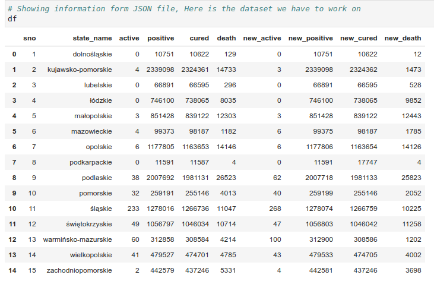

# Project - Covid 19

## Purpose of the program

Covid19 incidence analysis, 2 methods:

1. solution based on data from *.*csv file;
Data source for COVID infections by county: <a href="https://www.arcgis.com/sharing/rest/content/items/e16df1fa98c2452783ec10b0aea4b341/dat
a">arcgis.com</a>

Data source for COVID infections by county: <a href="https://arcgis.com/sharing/rest/content/items/b860f2797f7f4da789cb6fccf6bd5bc7/data">arcgis.com</a>

2. Solution based on data from JSON file.
Resluts:
 

 

 

 

 
## Created by Adrian Szklarski, 03.2023

